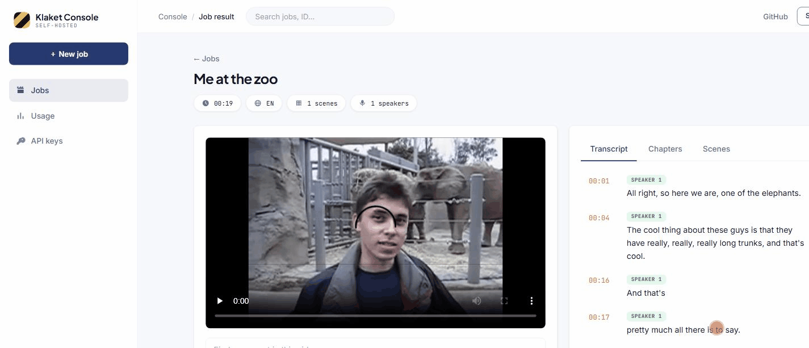

# 🎬 Klaket

**Turn any video into LLM-ready data.**

[](LICENSE)
[](CONTRIBUTING.md)
[](#quick-start)



> *Klaket* (Turkish): the clapperboard — the tool that syncs sound and image on a film set. **Klaket syncs video with LLMs.**

LLMs read text. The web became readable with scrapers — but video, the largest store of human knowledge, is still locked away. Klaket unlocks it: give it a video URL or file, get back structured, timestamped, LLM-ready data.

```bash
pip install klaket
klaket ingest "https://youtube.com/watch?v=..." --wait
```

```jsonc
{
  "transcript": [
    { "start": 14.32, "end": 19.80, "speaker": "S1", "text": "So let's deploy this with docker compose..." }
  ],
  "scenes": [
    { "start": 190.0, "end": 342.5, "keyframes": ["scene_004_01.jpg"] }
  ],
  "chapters": [...],
  "summary": "..."
}
```

## Features

- **📝 Transcript** — timestamped speech-to-text in **~100 languages** (auto-detected) with **word-level timestamps**; pick the model per job (`"model": "medium"`)
- **🎙️ Podcasts too** — pass an audio file/URL (mp3, m4a…) and Klaket skips the visual stages, deriving chapters from speech pauses
- **🗣️ Speaker diarization** — who said what (S1/S2/…), local & keyless (sherpa-onnx)
- **💬 Subtitles** — ready-to-use `.srt` / `.vtt` files with speaker labels
- **🎞️ Scene detection** — content-aware scene boundaries + keyframes per scene
- **🔎 On-screen text (OCR)** — reads slides, terminals and captions per scene, local & keyless
- **🧩 One JSON timeline** — transcript, scenes, frames and on-screen text aligned on a single timeline
- **🔌 Works offline, no API key required** — the core pipeline uses zero LLM calls
- **🧠 Pluggable model layer** — optional scene descriptions via local VLMs (Ollama) or any OpenAI-compatible endpoint (`KLAKET_VLM=off` by default)
- **🤖 MCP server** — let coding agents "watch" any video and find moments inside it
- **🔍 In-video search** — `GET /v1/jobs/{id}/search?q=…` finds the exact moment
- **▶️ Playground** — the dashboard plays the video with a click-to-seek, live-highlighted transcript

## SDKs

```python
# pip install klaket
from klaket import Klaket
result = Klaket().process("https://youtube.com/watch?v=...", num_speakers=2)
```

```ts
// npm i klaket-sdk
import { Klaket } from "klaket-sdk";
const result = await new Klaket().process("https://youtube.com/watch?v=...");
```

## Give your agent eyes

```bash
# Claude Code
claude mcp add klaket -- npx klaket-mcp   # KLAKET_API_URL defaults to localhost:8484
```

Then: *"Watch https://youtube.com/watch?v=… and summarize the commands the presenter runs."*
The agent gets `klaket_ingest`, `klaket_job_status` and `klaket_get_result` tools.

## Quick start

```bash
git clone https://github.com/huseyinstif/klaket.git && cd klaket
docker compose up --build
# API on :8484, dashboard on :5180
curl -X POST localhost:8484/v1/ingest \
  -H "Content-Type: application/json" \
  -d '{"url": "https://youtube.com/watch?v=..."}'
```

That's it — no API keys, no GPUs required. `make help` lists developer shortcuts (`make up`, `make test`, `make e2e`).

## Architecture

```
client ──► Go API ──► Redis queue ──► Python worker (ffmpeg · faster-whisper · scenedetect)
                │                          │
            dashboard ◄────────────────────┘   /data/jobs/<id>/result.json
```

- `apps/api` — Go, job orchestration
- `apps/worker` — Python, media pipeline
- `apps/dashboard` — React dashboard

## Self-host vs Cloud

Klaket is open source (AGPL-3.0) and fully self-hostable. A hosted, pay-per-minute cloud API with managed GPUs is planned — join the waitlist (coming soon).

## Status

🚧 v0.7 — pre-1.0, moving fast. Star the repo to follow along.

## License

[AGPL-3.0](LICENSE). SDKs and clients will be MIT.
